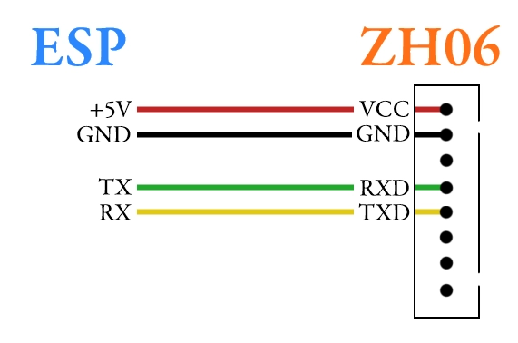

# zh06-esphome
ESPHome component for particulate matter sensor Winsen ZH06 and its sibilings (ZH06-II, etc).

The sensor uses laser scattering principle for detecting dust content in the air. 

- PM10, PM2.5, PM1 concentration measurement
- UART protocol witt baudrate 9600
- Supply voltage: 4.9 - 5.5V
- Data levels: 3.3V (TTL)
- Current consumption:
  - measurement: ＜120mA
  - idle: ＜20mA
- Startup time: 30s, stable measurement: < 45s
- Continuous working time (laser diode lifetime): > 10000 hours

To extend lifetime of laser diode, it is recommended to set time between sensor readings.
The component automatically disables the diode and internal fan after measurements.

## Installation
Add this custom component to your `.yaml` project:
```yaml
external_components:
  - source: github://naomai/zh06-esphome@main
```

Configure a UART bus in your ESPHome project. In the example
I'll be using GPIO33 as TX, and GPIO32 as RX.

```yaml
uart:
  baud_rate: 9600
  tx_pin: GPIO33
  rx_pin: GPIO32
```

To connect the sensor with included patch cable, use this chart:


### Quick start example
This example creates three sensors for each of the particle sizes. Readings are performed every 5 minutes to 
increase lifetime of laser diode.
```yaml
sensor:
  - platform: zh06
    update_interval: 5min
    pm_1_0:
      name: "LIVING ROOM Air quality (PM1)"
    pm_2_5:
      name: "LIVING ROOM Air quality (PM2.5)"
    pm_10_0:
      name: "LIVING ROOM Air quality (PM10)"
```

## Configuration variables
- `pm_1_0` (optional): concentration of particles of size below 1µm in µg per cubic meter. 
  All options from [Sensor](https://esphome.io/components/sensor/#config-sensor)
- `pm_2_5` (optional): concentration of particles of size below 2.5µm in µg per cubic meter. 
  All options from [Sensor](https://esphome.io/components/sensor/#config-sensor)
- `pm_10` (optional): concentration of particles of size below 10µm in µg per cubic meter. 
  All options from [Sensor](https://esphome.io/components/sensor/#config-sensor)
- `update_interval` (optional): time interval to check the sensor. 
  Defaults to `0min`, which means the continuous measurement.
- `uart_id` (optional): manually specify ID of the UART Component if you plan to use multiple buses.

## Attribution
The source and documentation is based on official component for 
[PMSX003 sensor](https://esphome.io/components/sensor/pmsx003.html).